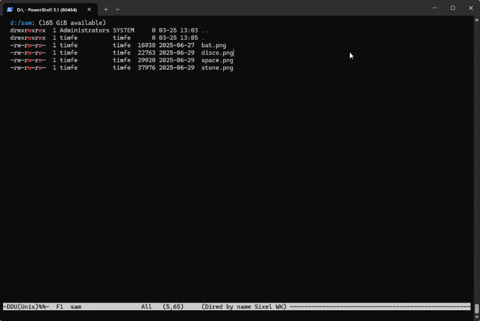

* sixel-graphics.el

Straight port from https://github.com/cashmeredev/kitty-graphics.el to use Sixel graphics instead.
See that repo for demos, they look pretty much the same with this.

** Why?

I use a terminal with Sixel support, but not Kitty. So there.

** Demo

** Requirements

Pretty much ~img2sixel~ gets you going.
On Windows I had luck with https://github.com/trackd/Sixel and a img2sixel.bat wrapper script.
Everything else is same as for GUI Emacs, ImageMagick to convert not natively supported images, Ghostscript for PDFs, LaTeX, etc.
You get the idea.

** Installation

#+begin_src elisp
  (use-package sixel-graphics
    :ensure t
    :vc (:url "https://github.com/timfel/sixel-graphics.el" :branch "main" :rev :newest))
#+end_src

** Usage

#+begin_src elisp
  (sixel-graphics-mode 1)
#+end_src

** Useful Commands

| Command                         | Description                                                    |
|---------------------------------+----------------------------------------------------------------|
| sixel-graphics-reprobe-terminal | Re-run terminal probing and report the current status          |
| sixel-graphics-clear-all        | Remove all Sixel overlays from all buffers and clear the cache |
| sixel-graphics-dired-preview    | Preview the image at point in dired                            |

** Customization

Via the ~sixel-graphics~ group.
